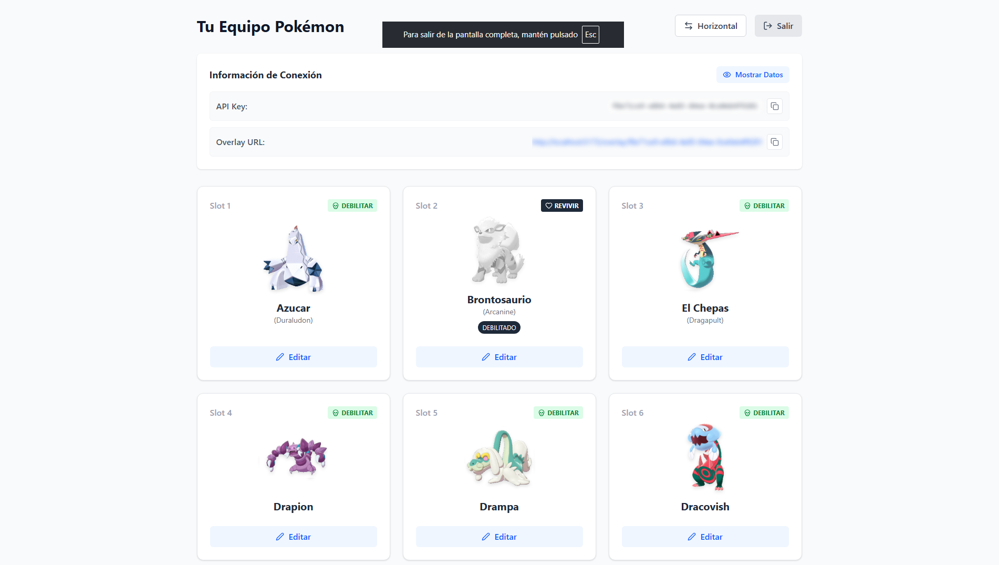

# 🔴 Pokémon Stream Overlay

Un overlay dinámico y profesional para streamers de Pokémon, diseñado específicamente para **Nuzlockes**. Gestiona tu equipo desde un panel web intuitivo y observa cómo se actualiza en tiempo real en tu transmisión de OBS.

## ✨ Características Principales

- **🔄 Sincronización en Tiempo Real**: Los cambios en el panel se reflejan instantáneamente en el overlay gracias a WebSockets.
- **🖱️ Drag & Drop**: Reordena tu equipo arrastrando y soltando los Pokémon.
- **🔍 Integración con PokéAPI**: Búsqueda automática de sprites y nombres de todos los Pokémon.
- **💀 Modo Nuzlocke**: Marca Pokémon como debilitados (KO) con un solo clic, aplicando efectos visuales automáticos (escala de grises, etiquetas).
- **📐 Layout Adaptable**: Cambia entre orientación **Horizontal** y **Vertical** desde el panel según el diseño de tu stream.
- **📱 Diseño Responsive**: Controla tu equipo desde tu móvil o tablet mientras juegas.
- **🔒 Panel de Administración**: Sistema completo para gestionar usuarios y API Keys.

## 🛠️ Tecnologías Usadas

### Frontend (`/fronted`)
- **React**: Librería principal de UI.
- **TailwindCSS**: Estilizado moderno y responsive.
- **Lucide React**: Iconografía limpia.
- **@dnd-kit**: Librería robusta para Drag & Drop.
- **Socket.io-client**: Comunicación en tiempo real.

### Backend (`/backend`)
- **Node.js & Express**: Servidor API RESTful.
- **Socket.io**: Servidor de WebSockets para eventos en tiempo real.
- **SQLite (better-sqlite3)**: Base de datos ligera y rápida (sin configuración compleja).
- **Rate Limit**: Protección contra abuso de API.

## 🎮 Cómo Usar

1. **Generar API Key**:
   - Ve a la página de inicio (`https://pokeoverlay.crezty.com`).
   - Haz clic en "Comenzar Ahora" o "Crear mi Overlay Gratis" para generar tu clave única.

2. **Gestionar tu Equipo**:
   - Ingresa al Panel con tu API Key.
   - Usa el buscador para añadir Pokémon.
   - Arrastra para ordenar.
   - Usa los controles para marcar KO o eliminar.

3. **Configurar en OBS**:
   - En el panel, haz clic en el botón de copiar junto a la "URL del Overlay".
   - En OBS, añade una nueva fuente de **Navegador**.
   - Pega la URL.
   - Establece el ancho y alto (ej: 1920x1080 o personalizado).
   - ¡Listo! El fondo es transparente por defecto.

## 🤝 Contribuir

¡Las contribuciones son bienvenidas! Si tienes ideas para mejorar el overlay o encuentras algún bug:

1. Haz un Fork del proyecto.
2. Crea una rama para tu feature (`git checkout -b feature/AmazingFeature`).
3. Haz Commit de tus cambios (`git commit -m 'Add some AmazingFeature'`).
4. Haz Push a la rama (`git push origin feature/AmazingFeature`).
5. Abre un Pull Request.

## 📄 Licencia

Este proyecto está bajo la Licencia CC BY-NC 4.0 - mira el archivo [LICENSE](LICENSE) para más detalles.

---
Hecho con ❤️ para la comunidad de Pokémon.
